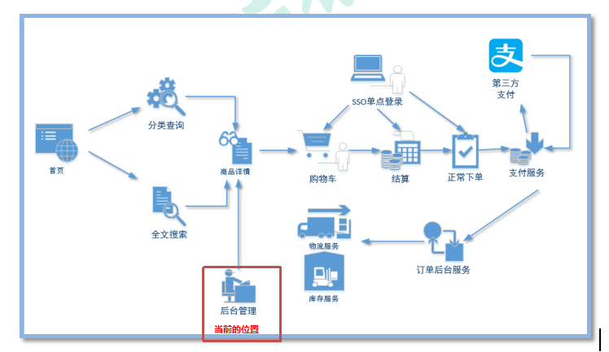

# sph_mall
## 1. 主要技术

- SpringBoot：简化新Spring应用的初始搭建以及开发过程

- SpringCloud：基于Spring Boot实现的云原生应用开发工具，SpringCloud使用的技术：（Spring Cloud Gateway、Spring Cloud Alibaba Nacos、Spring Cloud Alibaba Sentinel、Spring Cloud Task和Spring Cloud Feign等）

- MyBatis-Plus/通用Mapper：持久层框架

- Redis：内存做缓存  

- Redisson：基于redis的Java驻内存数据网格

- RabbitMQ：消息中间件

- ElasticSearch+Kibana+Logstash: 全文检索服务器+可视化数据监控+日志收集框架

- ThreadPoolExecutor：线程池来实现异步操作，提高效率

- Thymeleaf: 页面模板技术 

- **Swagger2*******\*/POSTMAN\****：Api接口文档工具

- MinIO：分布式文件存储类似于OSS，FastDFS

- 支付宝支付：alipay.com

- Mysql：关系型数据库 {mycat/sharding-jdbc 进行分库，分表}

- Lombok: 实体类的中get，set 生成的jar包

- Ngrok/natapp：内网穿透

## 2. 解决方案

- 分布式架构

- 缓存管理

- 分布式事务

- 单点登录

- 商品后台管理

- 文件管理系统

## 3. 整体业务分析图
